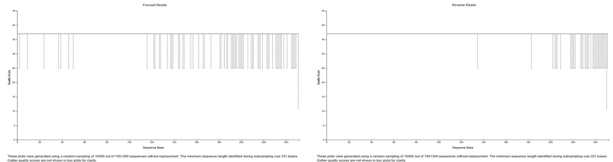
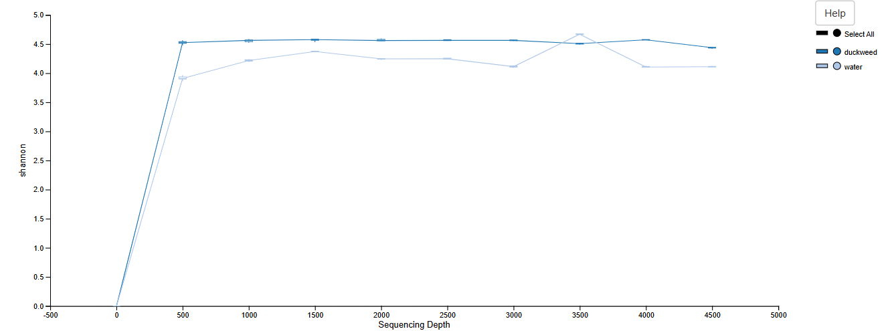
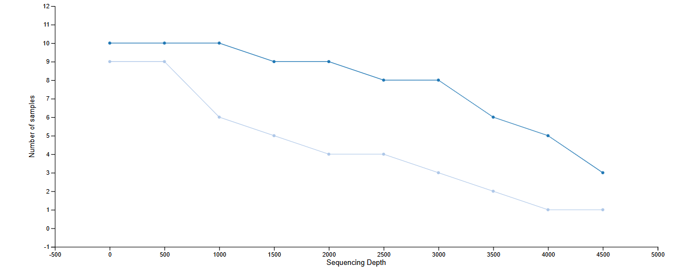
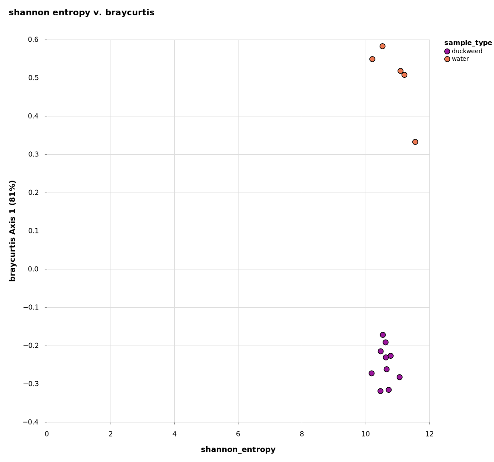
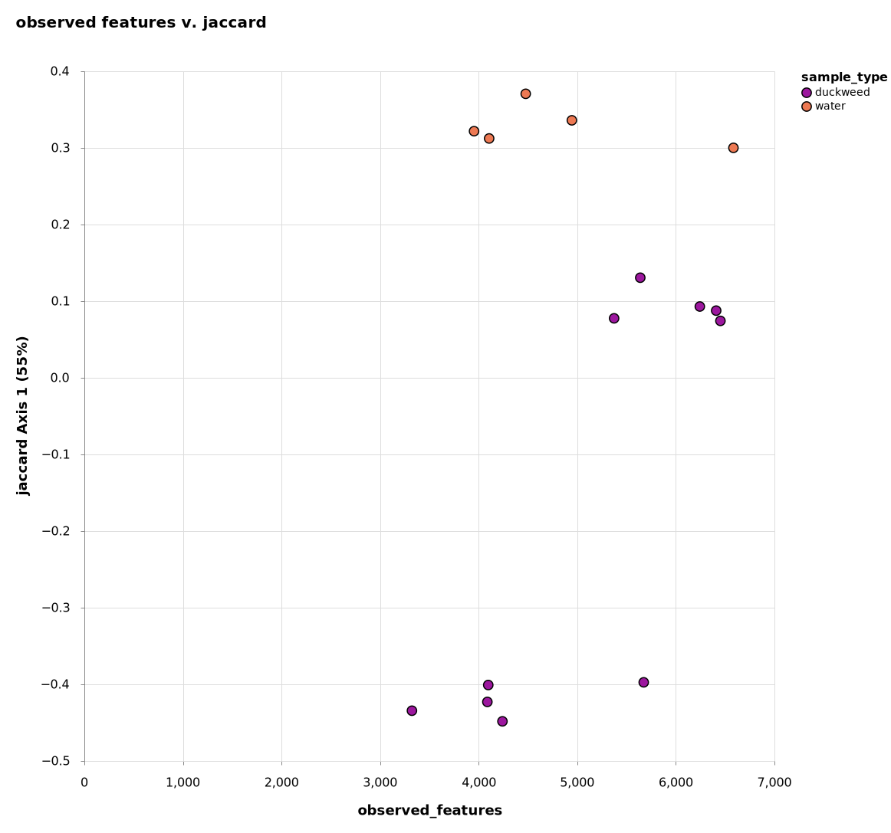
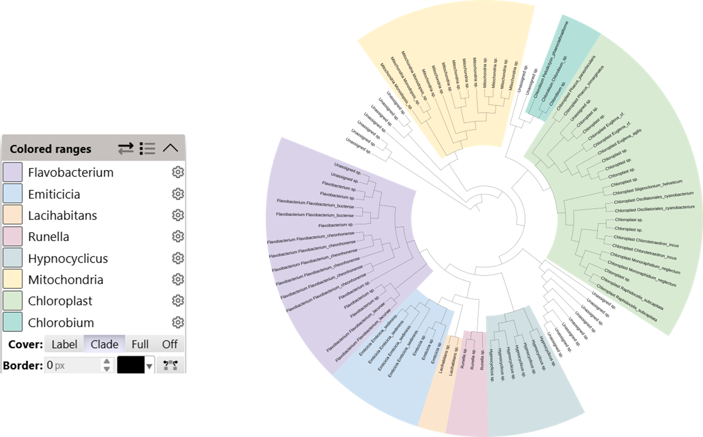
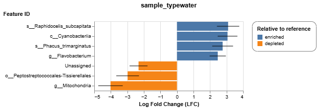

# Final_Project_711/811
# Duckweed Microbiome QIIME2 Project

The goal of this project is to analyze 16S rRNA sequencing data from microbiome samples associated with duckweed. The aim is to compare and identify the differences in microbial communities between duckweed surfaces and surrounding pond water using QIIME2.

## Group Members
- Julia Murray
- Kayla Royce

  
<strong>Project Overview</strong>

This bioinformatic pipeline utilizes data from two sampling locations, each consisting of two treatments, being duckweed surface microbiome and pond water microbiome. Five replicates were performed per treatment/location. The data consisted of 40 FASTQ files with 20 paired-end read samples, each being 250 base pairs long. The 16srRNA sequence were amplified via Illumina HiSeq 2500 format.

The pipeline was created following the QIIME2 "Gut-to-Soil Axis Tutorial", with the goal of classifiying and analyzing microbial taxonomy between sample types and the differences in microbial abundance. 

The final presentation can be found here: 
[Presentation](images/GEN711.Qiime2Presentation.pdf)

_all code used for the pipeline can be found under "final.sh" and data results can be found in their respective folders in the repo_

  
<strong>Methods</strong>

  

    
Importing Data

    Files used: manifest.tsv and metadata.tsv (already demultiplexed)  
    imported via: cp from /tmp/ 

  

  

    
Denoising Preparation

    Tools used:
    - demux summarize : converts demux.qza into demux.qzv (visualized file)  
      - used to determine where to denoise data

  

  

    
Denoising

    Tools used:
    - dada2 denoise-paired : used to denoise data  
      - forward reads trimmed at 220 bases  
      - reverse reads trimmed at 200 bases  
    - metadata tabulate : generates QIIME2 visualization of denoised data including feature IDs, sequences, and their counts  
      - used to determine where to filter samples  
    - tools export : used to export ASV representative sequences into BLAST-able file

  

  

    
Filtering

    Tools used:
    - feature-table filter-samples : removes samples with less than 1000 reads and removes sample ODR-3-3 (had 0 reads)  
    - feature-table summarize-plus : summarized the filtered ASV feature table with metadata information  
    - feature-table tabulate-seqs : creates compiled table of all ASV sequences and their frequency data  
    - feature-table filter-features : filters the feature table so all features must be present in a minimum of 25% of the samples  
    - feature-table filter-seqs : filters ASV representative sequences to match those in feature table  
    - feature-table summarize plus : create visualization of the filtered feature table

  

  

    
Taxonomic Classification

    Training Classifier  
    Tools used:
    - wget -o silva-138-99-seqs.qza and wget -o silva-138-99-tax.qza  
    - feature-classifier extract reads : filters the classifier for primer sequences  
      - forward primer: GTGCCAGCMGCCGCGGTAA  
      - reverse primer : GGACTACHVGGGTWTCTAAT  
    - feature-classifier fit-classifier-naive-bayes : trains custom classifier using previously filtered reference sequences and taxonomic classifier  

    Taxonomic Classification  
    Tools used:
    - feature-classifier classify-sklearn : assigns taxonomy to samples using the custom trained classifier  
    - feature-table tabulate-seqs : visualizes ASV sequences into feature table with taxonomic information

  

  

    
Phylogenetic Tree Construction

    Tools used:
    - phylogeny align-to-tree-mafft-fasttree : aligns the features in feature table and creates a rooted tree  
    - while loop used to create "itol.txt" : file with node IDs and assigned genus and species  
    - "rooted_tree.qza" and "itol.txt" uploaded to iTOL for phylogenetic tree construction  
    iTOL: https://itol.embl.de/

  

  

    
K-mer Based Diversity Analysis

    Tools used:
    - conda activate q2-boots-amplicon-2025.4 : activates QIIME2 environment with boots kmer-diversity commands  
    - boots kmer-diversity : computers kmer based diversity metrics to avoid bias from taxonomic assignment

  

  

    
Alpha-Rarefaction Plot

    Tools used:
    - diversity alpha-rarefaction: shows if selected sequencing depth contains majority of the species present

  

  

    
Taxonomic Bar-Plot

    Tools used:
    - taxa barplot : shows taxonomic composition and relative abundance for each sample type

  

  

    
Differential Abundance

    Tools used:
    - feature-table filter-samples : filters features to compare duckweed and water samples  
    - taxa collapse : collapses ASVs into species-level taxonomy (level 7)  
    - composition ancombc : performs ANCOM-BC testing to identify signficantly different species-level taxa across sample types  
    - composition da-barplot : visualizes results of ANCOM-BC analysis with signficance threshold of 0.001

  

  
<strong>Results</strong>

  

    
Denoising Plot

    

Figure 1.Graph demonstrating the quality scores of sequence bases of forward and reverse reads. The output is used to determine where to trim data during denoising steps of the pipeline. 
  

  

    
Alpha-Rarefaction Plot

    

Figure 2.Graph that demonstrates if denoised data maintains an adequate amount of features by comparing shannon index to sequencing depths. The output suggests that duckweed samples have a higher shannon index and greater microbial diversity. Plateaus of both samples demonstrate that most diversity was captured during denoising steps. 

Figure 3. Graph that demonstrates if denoised data maintains an adequate amount of features by comparing number of samples to sequencing depth. The output suggests that the duckweed samples manitain a higher retention across all sequencing depths, compared to water samples. As depth increases, fewer samples meet the depth threshold of both sample types. 
  

  

    
Diversity Analysis

    
 
Figure 4. PCA that compares the alpha diversity test of shannon entropy to the beta diversity test of braycurtis (accounts for 81% of variance). The output suggests that the water samples are less diverse per sample, but are compositionally distinct, while duckweed samples are more diverse within each sample and forms distinct cluster groups. The duckweed samples have rich and consistent microbial communities. 

Figure 5. PCA that compares the alpha diversity test of observed features, which tests for richness, and the beta diversity test jaccard (accounts for 55% of variance), which tests for presence/absence of microbes. The output suggests that water samples are richer in taxa count, due to having more observed features, and demonstrates intra-group variation, likely attributed to differences in sampling locations. The duckweed samples are more variable in richness due to some samples having fewer taxa.

  

  

    
Taxonomic Bar Plot

    

Figure 6. Taxonomic Bar Plot that demonstrates the species of microbes present, along with the frequencies, in duckweed samples (left) and water samples (right). 

  

  

    
Phylogenetic Tree

    

Figure 7. Phylogenetic tree that demonstrates the genus groups and species of microbial communities present across all samples. The tree infers genetic relationships between each species. 

  

  

    
Differential Abundance

Figure 8. Bar plot that utilizes ANCOM-BC testing to demonstrate that log fold change between species groups in water samples and duckweed samples. The output suggests that the water samples are enriched with s.Raphidocelis, cyanobacteria, phacus trimarginatus, and flavobacteria, while the water samples are depleted in unassigned microbe taxa, peptrostreptococcales tissierellales, and mitochondria, in comparison to duckweed samples. 

  

  
<strong>References</strong>

  
- [Qiime2 Tutorial](https://amplicon-docs.qiime2.org/en/latest/tutorials/gut-to-soil.html): Main tutorial used to create bioinformatic pipeline  
- [Parkinson's Mouse Tutorial](https://docs.qiime2.org/2024.10/tutorials/pd-mice/): Supplementary tutorial used to clarify steps and offer other ways to complete analyses in bioinformatic pipeline  
- [BLAST](https://blast.ncbi.nlm.nih.gov/Blast.cgi): Used to confirm taxonomy of features and determine amplified region  
- [iTOL Tutorial](https://itol.embl.de/help.cgi): Used as reference during construction of phylogenetic tree  
- [Qiime2 Classifiers](https://library.qiime2.org/data-resources): Used to determine which classifier to use during taxonomic classification  
- [ChatGPT](https://chatgpt.com/): Used for answering general questions about bioinformatic pipeline
  

